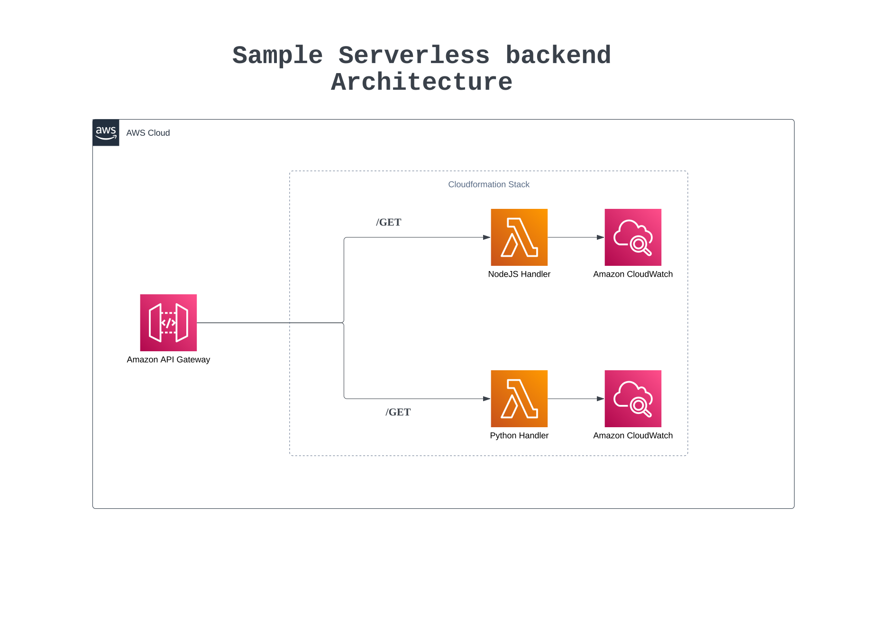

# Sample-Serverless-Backend-Service
This repository contains the source code and configurations for deploying a simple CloudFormation stack using the serverless microservice architecture.


> *Ignore the additional python lambda function in the diagram. It is not part of the sample project.*

## Sample Serverless function deployment to AWS
The sample serverless function deployment to AWS is a sample project that demonstrates how to deploy a serverless function to AWS. The sample project is a simple function that returns a greeting message. The sample project is written in Python and NodeJS and uses the Serverless framework to deploy the function to AWS.


## Prerequisites
- [AWS CLI](https://docs.aws.amazon.com/cli/latest/userguide/cli-chap-install.html)
- [Serverless Framework](https://www.serverless.com/framework/docs/getting-started/)
- [NodeJS](https://nodejs.org/en/download/)
- AWS Account
- AWS IAM User with Administrator Access

## Configuration
Open a terminal or command prompt and run the following commands to configure the AWS CLI with your AWS credentials.

```bash
aws configure
```

You can find your AWS Access Key ID and AWS Secret Access Key in the AWS Console by navigating to **My Security Credentials** under your account name.

Provide the Access Key ID and Secret Access Key when prompted. For the default region name, enter **ap-southeast-1**. For the default output format, enter **json**.


## Deployment
Open a terminal or command prompt and run the following commands to deploy the sample project to AWS.

```bash
cd project
./deployBackend.sh
```

> Make sure that the AWS CLI is configured with your AWS credentials before running the deployment script. And the shell script is executable.

> The shell script can be made executable by running the following command in the terminal or command prompt.
```bash
chmod +x deployBackend.sh
```

## Guide
The following sections provide a brief guide on how the sample project is structured and how to deploy the sample project to AWS.

### Project Structure
The sample project is structured as follows:


## Testing
To test the deployed serverless function via the AWS Management Console, you can follow these steps:

- Open the AWS Management Console.
- Navigate to the AWS Lambda service.
- Select the function that was deployed from the list of functions.
- Click on the "Test" button in the top-right corner.
- Configure the test event by providing any required input data.
- Click on the "Test" button to execute the function with the test event.
- View the function's output and any logs generated during execution.
- Please note that the specific steps may vary slightly depending on the AWS Management Console version and layout.

## Cleanup
To cleanup the deployed serverless function via the AWS Management Console, you can follow these steps:

- Open the AWS Management Console.
- Navigate to the AWS CloudFormation service.
- Select the stack that was deployed from the list of stacks.
- Click on the "Delete" button in the top-right corner.
- Confirm the deletion of the stack.
- Please note that the specific steps may vary slightly depending on the AWS Management Console version and layout.


## Glossary
- **AWS CLI** - AWS Command Line Interface
- **AWS IAM** - AWS Identity and Access Management
- **AWS Lambda** - AWS Serverless Function
- **AWS SAM** - AWS Serverless Application Model
- **AWS Serverless Function** - AWS Lambda
- **AWS CloudFormation** - AWS Infrastructure as Code service
- **AWS CloudFormation Stack** - Application stack deployed to AWS CloudFormation
- **Artifact Store** - AWS S3 Bucket that stores the deployment artifacts
- **Artifact Path** - Path to the deployment artifacts in the Artifact Store (subdirectories in the S3 bucket)


